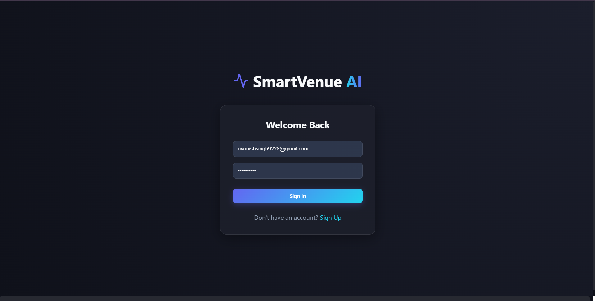
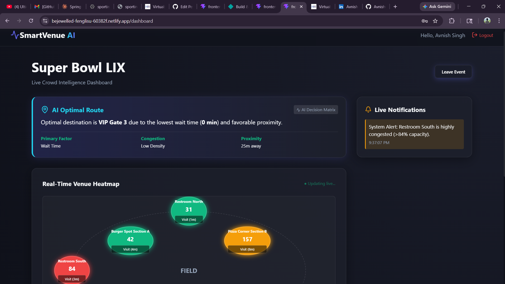

# 🚀 SmartVenue AI
An intelligent crowd management and optimization system designed to enhance the experience of attendees at large-scale sporting venues.
---
## 📌 Overview
SmartVenue AI simulates real-time crowd movement inside a stadium and provides:
- 📊 Live crowd monitoring
- ⏱️ Dynamic wait time estimation
- 🧭 Smart route recommendations
- 🔔 Real-time notifications
- 📈 Crowd trend & prediction
- 🚨 Emergency evacuation mode
The system helps users make smarter decisions and reduces congestion across venue zones.
---
## 🧠 Key Features
### 🔹 Real-Time Crowd Intelligence
- Live updates of crowd density across gates, food stalls, and restrooms
- Dynamic wait time calculation based on crowd size
### 🔹 Smart Route Recommendation
- Suggests optimal routes based on:
  - Wait time
  - Crowd density
  - Accessibility
### 🔹 Crowd Trend & Prediction
- Visualizes crowd changes over time
- Predicts future crowd levels using trend analysis
### 🔹 Interactive Simulation
- Users can interact with zones (visit gates/stalls)
- System updates dynamically
### 🔹 Live Notifications
- Alerts when zones become crowded
- Suggests better alternatives in real-time
### 🔹 Emergency Mode 🚨
- Highlights safest exits
- Provides evacuation guidance
---
## 🖼️ Screenshots
### 🔹 Login

### 🔹 Heatmap & Crowd Zones

---
## 🛠️ Tech Stack
### Frontend
- React (Vite)
- Recharts (for graphs)
- Tailwind / Custom CSS
### Backend
- Spring Boot (Java)
- REST APIs
### Real-Time Simulation
- Interval-based updates / WebSocket-ready architecture
---
## ⚙️ How to Run Locally
### 1️⃣ Backend
`bash
cd backend
mvn spring-boot:run`
### 2️⃣ Frontend
`bash
cd frontend\
npm install\
npm run dev`
